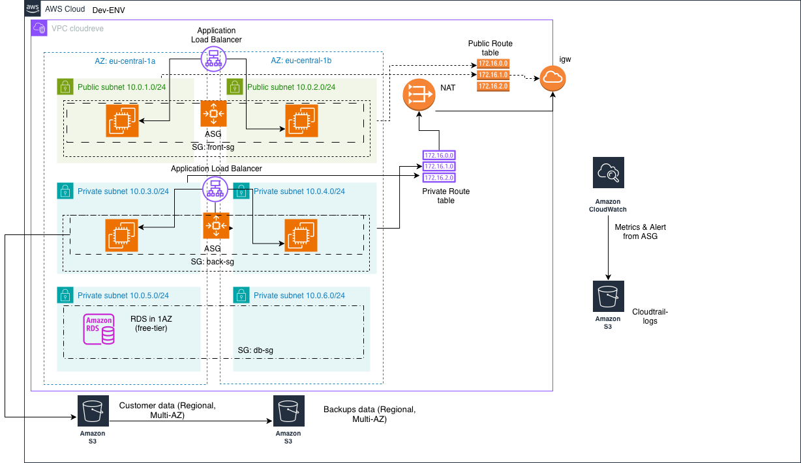

# Three-tier Architecture in AWS and Terraform

A three-tier architecture with:
* 3 tiers: frontend (public-facing), backend (private), database (private)
* 3 Security Groups, one for each tier
* 1 vpc in a region.
* 2 public subnets in 2 availability zones.
* 4 private subnets in 2 availability zones.
* 1 Internet Gateway.
* 1 Network Address Translation (NAT) Gateway.
* 2 Route Tables
* 1 Internet-facing Application Load Balancer
* 1 Auto-Scaling Group in the frontend tier
* 1 Internal Application Load Balancer
* 1 Auto-Scaling Group in the backend tier
* 1 RDS subnet group
* 1 RDS (MySQL) in the database tier
* 2 S3 buckets

## Overview
The system is a **file storage platform based on Cloudreve**, where **user files are stored in Amazon S3** and **metadata/users/permissions are stored in a relational database**.  
Current state: **DEV environment implemented**.  
Planned: **PROD environment with high availability and stronger security controls**.

---

## Logical Architecture (3-Tier)

### Application Tier
- **Cloudreve application** deployed on **Amazon EC2**
- Handles:
  - Authentication & authorization
  - File operations (upload, download, versioning, sharing)
  - Integration with S3 and RDS

**Justification:** EC2 provides full control over runtime, OS, and deployment model, which is required for a self-hosted open‑source application.

### Data Tier
- **Amazon RDS** (MySQL)
- Stores:
  - Users
  - File metadata
  - Permissions and quotas
- Deployed in **private subnets**

**Justification:** Managed relational database with automated backups, patching, and optional Multi‑AZ support.

### Storage Tier
- **Amazon S3**
- Stores all user file content as objects

**Justification:** Virtually unlimited scalability, very high durability, native Cloudreve support, and no need to manage storage capacity.

### Observability
- **Amazon CloudWatch**
- Metrics, logs, and alarms for:
  - EC2
  - RDS
  - Application behavior

**Justification:** Centralized monitoring and alerting with native AWS integration.

---

## Physical Architecture

- **Region:** eu-central-1 (Frankfurt)
- **Availability Zones:** eu-central-1a, eu-central-1b
- **VPC:** isolated network (CIDR: 10.0.0.0/16)

### Subnets
- **Public subnets (2× /24):**
  - Internet-facing components
  - DEV EC2 instance
  - Application Load Balancer
- **Private subnets (2× /24):**
  - Application EC2 instances (PROD)
  - RDS database
- **NAT Gateway:** outbound internet access for private subnets
- **Internet Gateway:** inbound/outbound internet for public subnets

**Justification:**  
Public/private separation minimizes attack surface. Multi‑AZ deployment increases fault tolerance.

---

## AWS Services and Rationale

| Service | Purpose | Reason for Choice |
|------|------|------|
| VPC | Network isolation | Full control over routing and segmentation |
| EC2 | Application hosting | Flexibility and control |
| RDS | Metadata storage | Managed DB, backups, HA |
| S3 | File storage | Scalability, durability |
| IAM | Access control | Least-privilege access model |
| CloudWatch | Monitoring & logging | Native observability |

---

## Security Design

### Network Security
- Private subnets for backend and database
- Security Groups allow:
  - HTTPS (443) only to public endpoints
  - DB access only from application SG

### Identity & Access
- **IAM Role attached to EC2**
  - Limited S3 permissions (Get/Put/List)
  - No static credentials on servers
- Administrative AWS access via IAM users with MFA

### Secrets Management
- **AWS Secrets Manager** (PROD)
  - Database credentials
  - Optional API keys
- No secrets stored in code or AMIs

### Encryption
- **In transit:** HTTPS (TLS)
- **At rest:** S3 and RDS encryption enabled

---

## Environments

### DEV (implemented)
- Application running EC2 instance in **front** ASG
- Single‑AZ RDS (free tier)
- Separate S3 bucket

### PROD (planned)
- Application EC2 in private subnets
- Multi‑AZ RDS
- Extended monitoring and backups

**Separation strategy:**  
Recommended — separate AWS accounts.  
Minimum — separate VPCs with non‑overlapping CIDRs.

---

## Key Architecture Characteristics

- **Scalability:** S3 scales automatically; EC2 can scale horizontally
- **High availability:** Multi‑AZ foundation
- **Security:** Least privilege, encryption, isolation
- **Operational readiness:** Centralized logs, metrics, alarms

---

This architecture follows AWS best practices and provides a secure, scalable foundation for a production‑grade file storage service.

---

## Variables
Most variables have default values in `variable.tf`. Modify them as you need. You need to specify the name of the key pair when using `terraform plan/apply/destroy`

* `region`: the region you want to put your VPC in
* `az1`: the first AZ. 
* `az2`: the second AZ.
* `db-name`: The name of the database name
* `db-username`: The username
* `db-password`: The password
* `keypair`: The name of the keypair for provisioning EC2
* `tags`: Tags to add to resources

## Outputs
* `db_address`: The hostname of the RDS instance. Need this to connect to RDS from the backend tier.
* `db_port`: the database port
* `public_alb_address`: The DNS name of the public-facing load balancer. Put it in the browser to access servers running on EC2s in the frontend tier.
* `private_alb_address`: The DNS name of the internal-facing load balancer. It won't work if you put it in the browser (it's INTERNAL-facing, close to public). ssh into EC2 instances and `curl '<private_alb_address>` then it works.

## Connecting to RDS from backend tier
1. `ssh` into EC2 instances in the backend tier
2. `mysql --host=<db_address> --user=<db-username> -p <db-name>`. Use `-p` so you'll be prompted to enter the password `<db-password>`.
